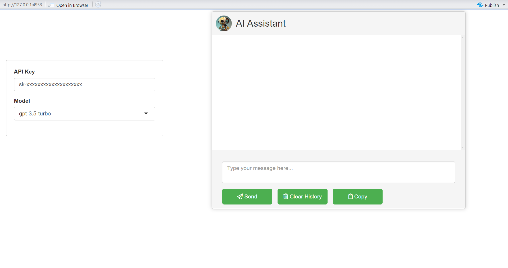
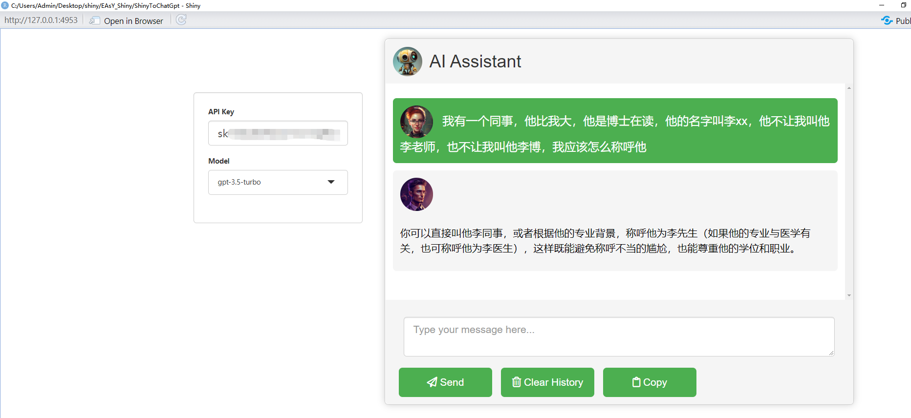

# ShinyToChatGpt
可在中国国内使用的chatgpt，请注意，您仍需要提供chatgpt-api-key

# 您需要了解

因为一些特别的原因，openAI并不在中国大陆提供服务，并且封锁了来自中国大陆的ip访问，因此我们搭建了一个能在中国国内使用的一个shiny程序。其通过反向代理去访问openAI所提供的api接口。请注意，请不要在此程序中泄露您的隐私，我们在此承诺，该程序不会收集您的各种隐私，然而仍有很多可能泄露您隐私的风险。

# 一 安装必要的包
1.运行以下命令安装在CRAN上的R包

```R
install.packages('pacman')# 先安装pacman方便您后续管理R包
library(pacman)
# 接着您需要安装以下R包
p_load('shiny',
       'httr',
       'sass',
       'markdown',
       'waiter',
       'shinyjs',
       'devtools')
# 最后您需要安装GitHub上的包
devtools::install_github('deepanshu88/shinyCopy2clipboard')
devtools::install_github('yimingsun12138/ChatGPT4R-CN')
```

# 二 启动
1.启动project.

2.启动app.R

使她看起来像这样的



# 三 获取您的chatgpt-api-key

在openAI官网中注册您的账号，并在个人界面生成api_key（如果您无法这么做，请联系我，qq邮箱：3224059800@qq.com），并在API Key中输入您的api，她看起来是这样的`sk-xxxxxxxxxxxxxxxxxxxx`。之后您在右侧文本框就可以输入您想要向chatgpt提问的对话，并点击Send，在此过程中您可以关闭您的代理或是VPN，其并不会影响该程序的对话过程。



